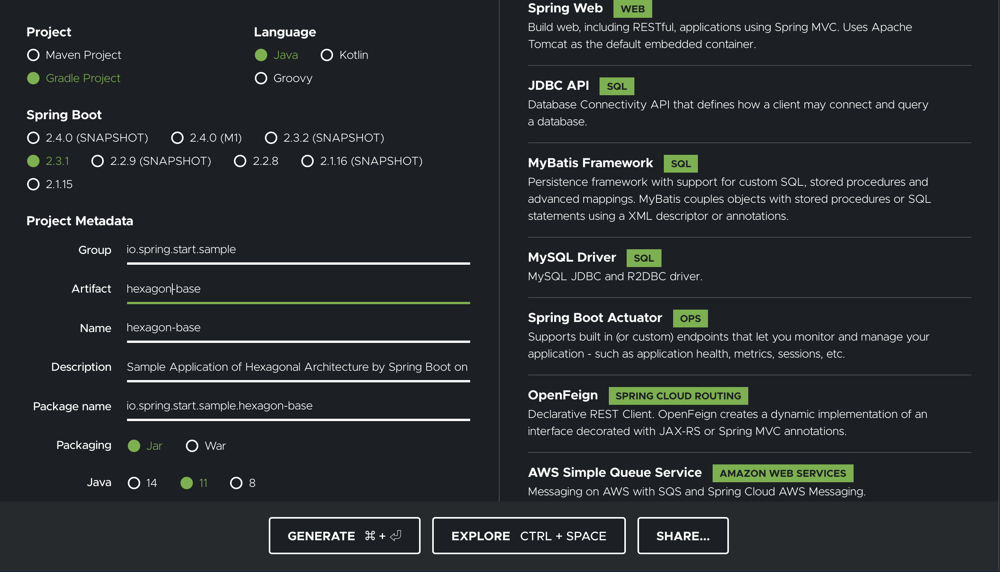

hexagonal-architecture-sample
===

0.what's this for?
---

This is Sample Application of Hexagonal Architecture by Spring Boot on Java.

And this sample application will be run only on your local.

Because, this is just sample application for who wanna be learning about an application on java with hexagonal architecture.

### using infrastracture

Use the following infrastructure, assuming to use AWS.

- Database
  - MySQL (As Amazon RDS/Aurora)
- KVS/NoSQL
  - Redis (As Amazon Elasticache)
- Message Queue
  - Elastic MQ (As Amazon SQS)
- Storage
  - Minio (As Amazon S3)

These infrastructui set up by Docker in your local


1.How to start to create project
---

### 1.Spring Initializer


First, get a project files for you wanna be set by Spring Initializer.

[https://start.spring.io/](https://start.spring.io/)

##### like this



##### root/sub project settings

```
# execute this command under local repository
$ unzip hexagon-base.zip

# move to root project
$ rm hexagon-base/HELP.md
$ mv hexagon-base/.gitignore ./
$ mv hexagon-base/gradle ./gradle
$ mv hexagon-base/gradlew* ./
$ cp ./hexagon-base/build.gradle ./

# create sub-projects
$ cp -r ./hexagon-base ./sub-project-name

# no application project only
$ rm sub-project-name/src/main/java/io/spring/start/sample/**/*Application.java
$ rm sub-project-name-api/src/main/resources/application.properties

# application project only
$ mv sub-project-name-api/src/main/resources/application.properties sub-project-name-api/src/main/resources/application.yml
```

### 2.Split Initial Project for Hexagonal Architecture

##### layout

```
├── hexagon-adapter-kvs
│   └── build.gradle
├── hexagon-adapter-mq
│   └── build.gradle
├── hexagon-adapter-persistence
│   └── build.gradle
├── hexagon-adapter-storage
│   └── build.gradle
├── hexagon-adapter-web
│   └── build.gradle
├── hexagon-base
│   └── build.gradle
├── hexagon-batch-scheduler
│   └── build.gradle
├── hexagon-consumer
│   └── build.gradle
├── hexagon-web-api
│   └── build.gradle
├── build.gradle
└── settings.gradle
```

##### settings.gradle

Set root-name and include sub-projects.

```
$ mv hexagon-base/settings.gradle ./

$ vim ./settings.gradle
```

### 3.Run Applications in your local

##### set up by docker-compose

```
# boot run
$ docker-compose up -d

# check
$ docker-compose ps

  Name                 Command               State                  Ports
---------------------------------------------------------------------------------------
elasticmq   /opt/docker/bin/elasticmq- ...   Up       0.0.0.0:9324->9324/tcp
minio       /usr/bin/docker-entrypoint ...   Up       0.0.0.0:9000->9000/tcp
minioc      /bin/sh -c  until (/usr/bi ...   Exit 0
mysql       docker-entrypoint.sh mysql ...   Up       0.0.0.0:3306->3306/tcp, 33060/tcp
redis       docker-entrypoint.sh redis ...   Up       0.0.0.0:6379->6379/tcp

# stop
$ docker-compose stop

# delete
$ docker-compose rm -f
```

##### set up Web API application with Database by flyway

```
$ gradle hexagon-web-api:bootRun
```


